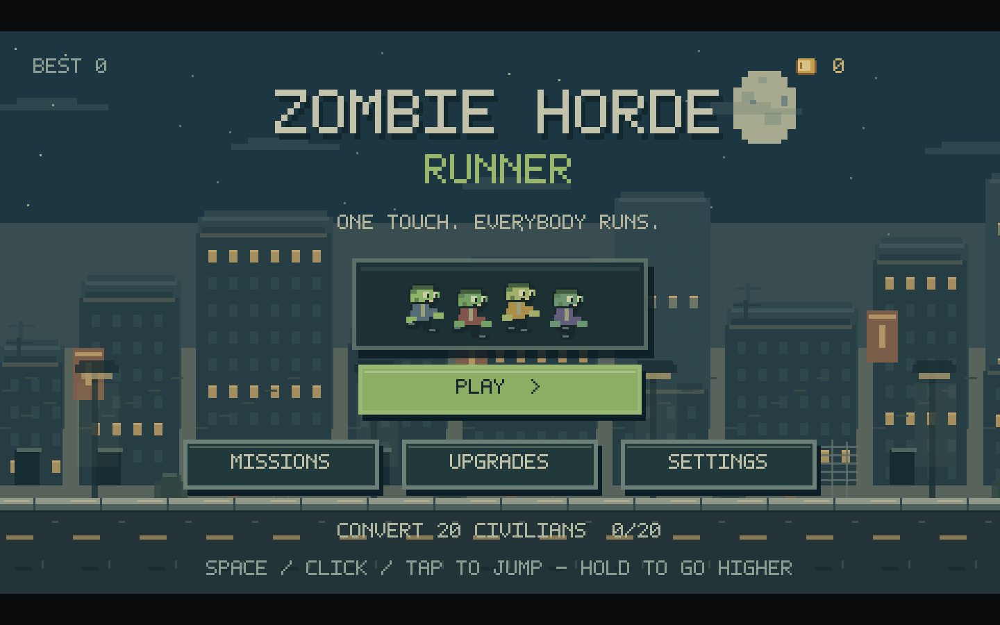
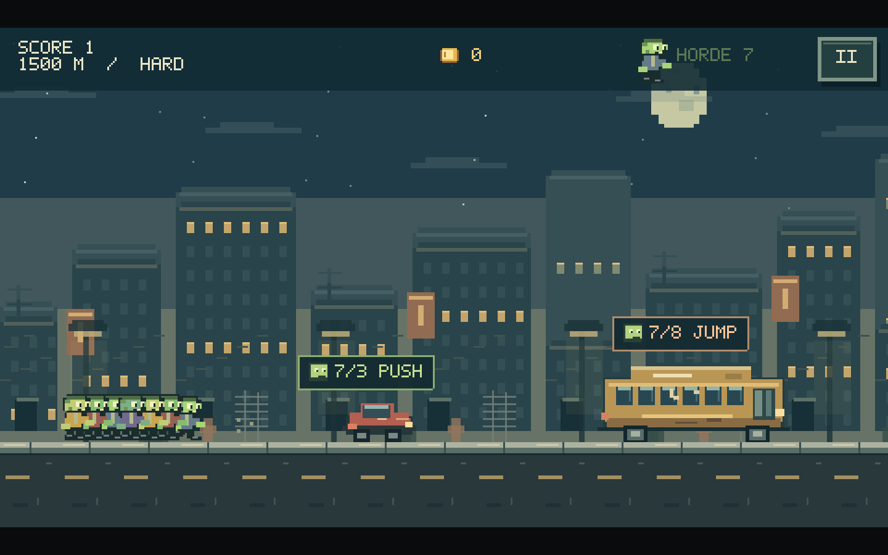
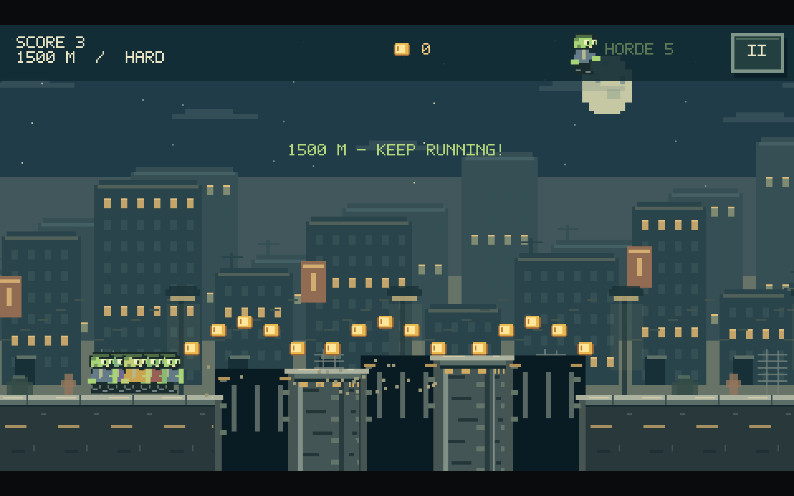
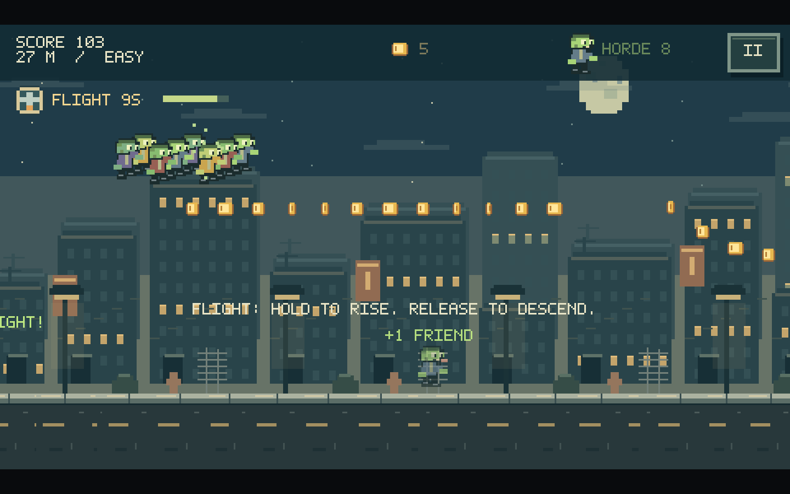
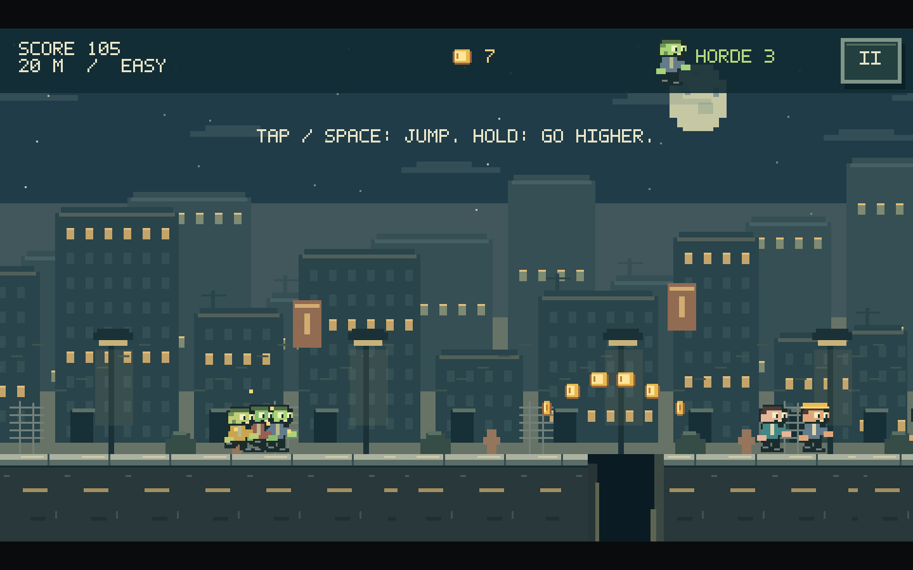

# Zombie Horde

**A one-touch pixel-art endless runner about growing, protecting, and risking a physical zombie horde.**

Guide an expanding crowd through a collapsing city, rescue civilians, collect supplies, cross broken roads, and decide whether the horde is strong enough to push through vehicles or should jump over them. Every zombie is an independent physics body, so poor timing can cost only the members who actually collide or fall.




## Project Links

- **Repository:** [github.com/philyai/PIXEL-GAME](https://github.com/philyai/PIXEL-GAME)
- **Live game:** No public deployment is currently available.

## Core Features

### Physical Horde Movement

Every living zombie has its own compact Arcade Physics body. The leader records jump presses and releases in world space, then trailing members replay those commands as they reach the same point. Early, late, and missed jumps therefore produce physical partial losses instead of random damage to the whole group.

### Horde-Powered Vehicle Encounters

Cars, buses, and grounded aircraft show a live world-space `CURRENT / REQUIRED` marker before contact. A grounded horde at or above the displayed requirement enters a short locked push, compresses against the vehicle, and breaks through without losing members to duplicate collision callbacks. An undersized horde can jump or suffer a physical failed push.

| Obstacle | Required horde | Alternative route |
|---|---:|---|
| Car | 3 | Jump over the body |
| Bus | 8 | Traverse its segmented roof |
| Airplane | 16 | Use the wing, fuselage, and tail surfaces |



### Distance-Based Challenge Progression

Difficulty grows with distance through speed, obstacle frequency, authored pattern complexity, pit size, landmine count, terrain elevation, vehicle frequency, recovery space, and civilian scarcity. The system caps running speed while continuing to introduce harder combinations, so late-game difficulty is more than a speed multiplier.

### Authored Platforming Patterns

The procedural system selects from validated chunks containing tiny through very-large pits, pit–pillar–pit sequences, double pillars, raised and lowered roads, vehicle approaches, mine groups, and mixed late-game challenges. Geometry validation checks entry and exit height, landing width, jump reach, mine clearance, supported entity placement, and reaction space.



### Localized Hazards and Losses

Pits, mines, terrain walls, and failed jumps evaluate the actual bodies involved. Mines use a one-shot blast radius; pits remove only members whose bodies fall into the opening; vehicle jump failures affect only the zombies that physically hit a collision zone. Game Over begins only when the authoritative living horde count reaches zero.

### Flight Routes and Safe Landing

Flight adds controllable vertical movement, five airborne coin formations, sparse aerial hazards, and a guided final landing phase. The system reserves a continuous safe road for the full formation and waits until every survivor is grounded before Flight ends.



### Progression and Replay

- Persistent best score, coins, settings, missions, and upgrades through local storage.
- Five timed powers: Magnet, Rage, Giant, Flight, and Boost.
- Missions for conversions, vehicle destruction, and coin collection.
- Upgrades for starting horde size, power duration, coin bonuses, and supply frequency.
- Pause, restart, results, retry, keyboard navigation, mouse input, and mobile landscape touch controls.

## Original Pixel-Art Presentation

The game uses a 480 × 270 virtual canvas with aspect-preserving scaling and nearest-neighbor rendering. Character poses, vehicles, hazards, terrain, icons, bitmap lettering, city layers, effects, and synthesized sound cues are authored in the codebase. The browser favicon uses the supplied Zombie Horde artwork in pixel-sharp 16px, 32px, and 180px sizes.



## Controls

| Action | Keyboard | Pointer / Touch |
|---|---|---|
| Jump | `Space` or `Up Arrow` | Press or tap |
| Higher jump | Hold the jump key | Hold the pointer or touch |
| Flight rise | Hold the jump key | Hold |
| Flight descend | Release | Release |
| Pause / resume | `Escape` or `P` | Pause button |
| Menu navigation | `Tab` or arrow keys, then `Enter` | Click or tap |

Music starts disabled and can be enabled from Settings.

## Technology

- **Phaser 3** for scenes, rendering, input, cameras, tweens, and Arcade Physics.
- **TypeScript** for gameplay systems, entities, procedural generation, and typed configuration.
- **Vite** for the development server and production build.
- **Playwright** with Microsoft Edge for deterministic gameplay, responsive, persistence, and regression tests.
- **Canvas-generated assets** for the original sprite and interface pipeline.

## Architecture

```text
src/
├── art/       Pixel sprites, large vehicles, terrain, and city scenery
├── config/    World constants and shared traversal physics
├── entities/  Horde members, civilians, obstacles, and power-ups
├── scenes/    Boot, menu, gameplay, and results lifecycle
├── systems/   Difficulty, chunks, collisions, Flight, audio, saves, and scoring
└── ui/        Bitmap text, panels, buttons, and keyboard navigation
```

`GameScene` owns the run lifecycle and coordinates focused systems. `Horde` owns the authoritative living-member registry and individual movement. `ChunkSpawner` streams validated authored patterns. `CollisionManager` provides a single obstacle-resolution path so pushing, breaking, and individual damage cannot resolve the same collision independently.

## Run Locally

Requirements: Node.js 20 or newer and npm.

```powershell
git clone https://github.com/philyai/PIXEL-GAME.git
cd PIXEL-GAME
npm.cmd install
npm.cmd run dev
```

Open the local address printed by Vite. Press `Ctrl+C` in the terminal to stop the server.

On macOS or Linux, use `npm` in place of `npm.cmd`.

## Build and Test

```powershell
npm.cmd run build
npm.cmd test
```

The latest complete regression run passed **115 Playwright tests**. Coverage includes:

- Full play, pause, death, results, retry, save migration, missions, and upgrades.
- Short and held jumps at 20, 30, 60, and 120 FPS simulations.
- Individual pit, mine, terrain, roof, and vehicle collisions.
- Horde sizes 1, 5, 10, and 20 across early, ideal, late, and missed pit timing.
- Car, bus, airplane, truck, armored vehicle, moving car, and fence thresholds.
- Ninety repeated exact-threshold vehicle pushes across low, medium, and maximum speed.
- Flight route control, collection, landing reservation, and safe completion.
- Desktop, mobile landscape, and portrait viewport containment.
- Long-run world streaming and bounded active object cleanup.

The production build also passes. Vite reports a bundle-size advisory for the Phaser application bundle; this is a performance consideration rather than a build failure.

## Development Process

### The Challenge

An endless runner with many visible followers can easily become a disguised single-character game. Shared hitboxes, random percentage damage, instant obstacle deletion, or delayed input make losses feel arbitrary. Procedural generation can also create impossible combinations unless it understands the same movement physics used at runtime.

### The Solution

- **Spatial Input Replay:** Followers reproduce both the press and release at the correct world position, keeping different frame rates and horde sizes consistent.
- **Independent Collision Bodies:** Each zombie can jump, land, collide, fall, and die without applying a global penalty to the formation.
- **Atomic Vehicle Resolution:** Grounded push success is locked from the same authoritative count shown by the marker, preventing duplicate callbacks from killing members during a valid break.
- **Physics-Aware Generation:** Authored chunks are validated against jump reach, elevation, landing surfaces, hazard spacing, and distance-specific limits.
- **Bounded Runtime Systems:** Offscreen entities are cleaned up, particle effects are capped, and large-horde rendering remains visible rather than silently limiting followers.
- **Deterministic Browser QA:** Controlled scenes reproduce boundary conditions while the full-flow tests preserve real menu, input, progression, and retry behavior.

## Key Takeaways

Building Zombie Horde strengthened my understanding of stateful gameplay architecture, Arcade Physics, deterministic collision resolution, procedural level validation, pixel-art tooling, responsive canvas interfaces, and browser-based game testing. The most valuable lesson was aligning player-visible information with the exact gameplay source of truth: when the game says `4 / 3 PUSH`, the collision system must guarantee that result.

## Documentation

- [Implementation and original verification](IMPLEMENTATION.md)
- [Large-vehicle, traversal, and Flight update](GAMEPLAY_UPDATE.md)
- [Challenge and horde-survival update](CHALLENGE_UPDATE.md)
- [Vehicle collision root-cause report](VEHICLE_COLLISION_FIX.md)
- [Product context](PRODUCT.md)
- [Visual design system](DESIGN.md)

## Current Limitations

- The city is the only implemented biome.
- Progress is stored locally; there is no account or cloud save.
- The game is intended for desktop and mobile landscape. Portrait mode remains contained through letterboxing.
- Automated testing covers Microsoft Edge in this environment. Physical phone performance and touchscreen feel still need device testing.
- There is no public hosted build yet.
